# Aula Prática - 6 - RAID

## RAID 5 e falhas

1. Utilize o dd para criar 8 ficheiros de 100MB cada um. Usando o losetup crie 8 dispositivos (devices) /dev/loop associado a cada ficheiro. Pode usar losetup --find --show disc1( assumindo que disc1 era um dos ficheiros criados)
****

    #Para obter mais detalhes, ver descricao dos comandos presentes no ficheiro create_files 
    $ sudo chmod +x ./Desktop/Administracao_Sistemas/aula06/create_files 
    $ ./Desktop/Administracao_Sistemas/aula06/create_files
    
    # Verificacao
    $ ls -la | grep arquivo

    #Para obter mais detalhes, ver descricao dos comandos presentes no ficheiro create_files 
    $ sudo chmod +x ./Desktop/Administracao_Sistemas/aula06/associate
    $ ./Desktop/Administracao_Sistemas/aula06/associate

    # Verificacao 
    $ losetup -a | grep arquivo
    /dev/loop19: []: (/home/rui/arquivo_5)
    /dev/loop17: []: (/home/rui/arquivo_3)
    /dev/loop15: []: (/home/rui/arquivo_1)
    /dev/loop21: []: (/home/rui/arquivo_7)
    /dev/loop18: []: (/home/rui/arquivo_4)
    /dev/loop16: []: (/home/rui/arquivo_2)
    /dev/loop22: []: (/home/rui/arquivo_8)
    /dev/loop20: []: (/home/rui/arquivo_6)

2. Recorrendo à ferramenta mdadm e aos discos virtuais que inicializou na alínea anterior, defina dois vectores RAID5 (/dev/md0 e /dev/md1) com 4 discos cada.
****
    Cada array RAID5 (/dev/md0 e /dev/md1) precisa de 4 dispositivos loop para funcionar, já que RAID5 requer no mínimo 3 discos, mas estamos configurando com 4 para redundância extra.

    # Criar o primeiro array RAID5 (md0) com os dispositivos loop15 a loop18 (/dev/loopI depende do output de  losetup -a | grep arquivo)
    $ sudo mdadm --create --verbose /dev/md0 --level=5 --raid-devices=4 /dev/loop15 /dev/loop16 /dev/loop17 /dev/loop18
    mdadm: layout defaults to left-symmetric
    mdadm: layout defaults to left-symmetric
    mdadm: chunk size defaults to 512K
    mdadm: size set to 100352K
    mdadm: Defaulting to version 1.2 metadata
    mdadm: array /dev/md0 started.

    # Criar o segundo array RAID5 (md1) com os dispositivos loop19 a loop22 (/dev/loopI depende do output de  losetup -a | grep arquivo)
    $ sudo mdadm --create --verbose /dev/md1 --level=5 --raid-devices=4 /dev/loop19 /dev/loop20 /dev/loop21 /dev/loop22
    mdadm: layout defaults to left-symmetric
    mdadm: layout defaults to left-symmetric
    mdadm: chunk size defaults to 512K
    mdadm: size set to 100352K
    mdadm: Defaulting to version 1.2 metadata
    mdadm: array /dev/md1 started.

    Descricao dos comados:

        mdadm --create --verbose: Inicia a criação de um array RAID e exibe detalhes do processo.
        
        /dev/md0 e /dev/md1: Nomes dos arrays RAID que estamos criando.
        
        --level=5: Configura o nível RAID5, que distribui a paridade entre os discos, permitindo tolerância a falhas de um disco.

        --raid-devices=4: Define o número de dispositivos em cada array.

        /dev/loopX: Especifica os dispositivos loop que serão incluídos no array RAID5.    

+ Verifique no ficheiro /proc/mdstat (faça cat deste ficheiro) se ficou tudo devidamente configurado e correctamente inicializado.
****

    $sudo cat /proc/mdstat 
    Personalities : [raid6] [raid5] [raid4] 
    md1 : active raid5 loop22[4] loop21[2] loop20[1] loop19[0]
      301056 blocks super 1.2 level 5, 512k chunk, algorithm 2 [4/4] [UUUU]
      
    md0 : active raid5 loop18[4] loop17[2] loop16[1] loop15[0]
      301056 blocks super 1.2 level 5, 512k chunk, algorithm 2 [4/4] [UUUU]
      

+ Nos pontos seguintes pode ser interessante ter numa outra shell o comando watch -n 1 -d cat /proc/mdstat a correr. Veja o que faz o watch.
****

	watch - execute a program periodically, showing output fullscreen

    t1 $ watch -n 1 -d cat /proc/mdstat

    
+ Veja também o resultado de mdadm /dev/md0.
****

    $ sudo mdadm /dev/md0
    /dev/md0: 294.00MiB raid5 4 devices, 0 spares. Use mdadm --detail for more detail.

    $  sudo mdadm --detail /dev/md0 
    /dev/md0:
               Version : 1.2
         Creation Time : Mon Nov  4 20:44:19 2024
            Raid Level : raid5
            Array Size : 301056 (294.00 MiB 308.28 MB)
         Used Dev Size : 100352 (98.00 MiB 102.76 MB)
          Raid Devices : 4
         Total Devices : 4
           Persistence : Superblock is persistent

           Update Time : Mon Nov  4 20:44:47 2024
                 State : clean 
        Active Devices : 4
       Working Devices : 4
        Failed Devices : 0
         Spare Devices : 0

            Layout : left-symmetric
        Chunk Size : 512K

    Consistency Policy : resync

                  Name : ubuntu2:0  (local to host ubuntu2)
                  UUID : 29309aa6:e005ac2a:67ea3e5a:a0107b1d
                Events : 18

        Number   Major   Minor   RaidDevice State
           0       7       15        0      active sync   /dev/loop15
           1       7       16        1      active sync   /dev/loop16
           2       7       17        2      active sync   /dev/loop17
           4       7       18        3      active sync   /dev/loop18

3. Contrua agora um RAID1 em /dev/md2 com os dispositivos /dev/md0 e /dev/md1. Ou seja um mirroring de 2 RAIDs 5.

>Note que a criação da metadata para o RAID 1 pode invalidar colocar bootloaders (irrelevante para o caso em questão). Por isso o aviso. Ver [RAID superblock](https://archive.kernel.org/oldwiki/raid.wiki.kernel.org/index.php/RAID_superblock_formats.html#Sub-versions_of_the_version-1_superblock) para mais detalhes. Não é claro porque não há aviso no RAID 5, pois os metadados estão no mesmo local.

    $ sudo mdadm --create /dev/md2 --level=1 --raid-devices=2 /dev/md0 /dev/md1

    Explicação dos parâmetros:

    --create /dev/md2: cria um novo array RAID com o nome /dev/md2.
    
    --level=1: define o tipo de RAID como RAID1 (espelhamento).
    
    --raid-devices=2: indica que dois dispositivos serão utilizados no RAID1.

    /dev/md0 /dev/md1: especifica que os dispositivos a serem espelhados são os arrays /dev/md0 e /dev/md1.

    # Verificacao do RAID1 criado
    $ sudo mdadm --detail /dev/md2
    /dev/md2:
               Version : 1.2
         Creation Time : Mon Nov  4 20:56:49 2024
            Raid Level : raid1
            Array Size : 300032 (293.00 MiB 307.23 MB)
         Used Dev Size : 300032 (293.00 MiB 307.23 MB)
          Raid Devices : 2
         Total Devices : 2
           Persistence : Superblock is persistent

           Update Time : Mon Nov  4 20:56:52 2024
                 State : clean 
        Active Devices : 2
       Working Devices : 2
        Failed Devices : 0
         Spare Devices : 0

    Consistency Policy : resync

                  Name : ubuntu2:2  (local to host ubuntu2)
                  UUID : 92b8f3fc:dedc9c14:6bab6d55:226f3aaf
                Events : 17

        Number   Major   Minor   RaidDevice State
           0       9        0        0      active sync   /dev/md0
           1       9        1        1      active sync   /dev/md1

> Notificacao do terminal a correr (watch -n 1 -d cat /proc/mdstat)
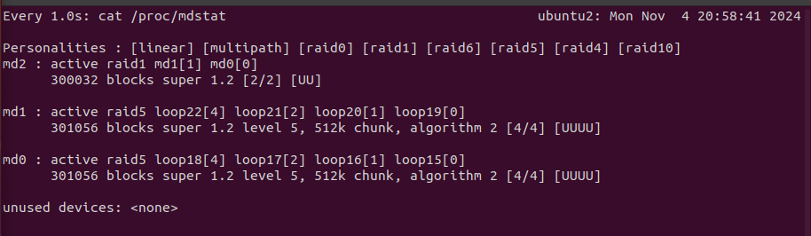

4. Veja com mdadm -Q /dev/md0 a que pertence o md0.
****

    $ sudo mdadm -Q /dev/md0
    /dev/md0: 294.00MiB raid5 4 devices, 0 spares. Use mdadm --detail for more detail.
    /dev/md0: device 0 in 2 device active raid1 /dev/md2.  Use mdadm --examine for more detail.

5. Construa um sistema de ficheiros ext4 no dispositivo /dev/md2. Note que pode ter um aviso de alinhamento de setores. Isto afeta a performance do uso do disco (se usar XFS não constrói sem force). No nosso exercício não será relevante, mas pode dar uma olhada nas referências abaixo.
****

    $ sudo mkfs.ext4 /dev/md2

+ Monte o sistema de ficheiros criados numa pasta em /mnt/ e copie alguns ficheiros (ex.: um dos disc criados na alínea 1).
****
    # Agora, vamos montar o sistema de arquivos criado no RAID /dev/md2 em um diretório de montagem:
    $ sudo mkdir -p /mnt/raid2
    $ sudo mount /dev/md2 /mnt/raid2

    # Verificar -  Copiar Arquivos para o RAID Montado
    $ sudo cp ./Desktop/Administracao_Sistemas/aula06/aula6.md /mnt/raid2/ 
    $ ls /mnt/raid2/
    aula6.md  lost+found

+ Qual o número mínimo de discos que teriam de falhar simultaneamente para o sistema falhar? No total? Só num dos RAID (/dev/md[0,1,2])?
****

    Cada array RAID5 (como /dev/md0 ou /dev/md1) pode tolerar a falha de um único disco. Isso significa que, dentro de um RAID5, se dois discos falharem ao mesmo tempo, o array falha.

    O RAID1 espelha os dois arrays RAID5. Portanto, ele pode continuar operando enquanto pelo menos um dos dois arrays RAID5 (ou seja, /dev/md0 ou /dev/md1) permanecer funcional.

    Para o sistema completo falhar (isto é, /dev/md2 falhar completamente), seria necessário que dois discos falhassem simultaneamente em um dos arrays RAID5 (ou seja, dois discos em /dev/md0 ou dois discos em /dev/md1).

    Em um único RAID5 (/dev/md0 ou /dev/md1): basta a falha de dois discos simultâneos para que o array falhe, levando ao colapso do RAID1.

`

6. Monitorizando o sistema (com mdadm --detail ou com /proc/mdstat) veja o resultado de marcar um disco com defeito, para testar o que respondeu na alínea anterior. Não será possível colocar a failed mais do que 1 disco do S.O.
**** 

    Para simular a falha de um disco no RAID5 (/dev/md0), utilize o comando abaixo para marcar o dispositivo /dev/loop15 como falho:

    $ sudo mdadm /dev/md0 --fail /dev/loop15

>Atualizou o numero de discos disponiveis no /proc/mdstat
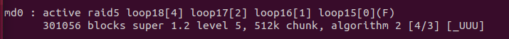

+ Tente usar o sistema de ficheiros montado (copiar e/ou ler ficheiros). Note que como indica no manual do mdadm os dispositivos são marcados como em falha para depois serem removidos.
****

    # Testar o Uso do Sistema de Arquivos
    Tente acessar o sistema de arquivos montado no RAID1 /dev/md2 (que espelha os RAIDs5 /dev/md0 e /dev/md1). Experimente copiar ou ler arquivos para verificar a funcionalidade do array:

    # Copiar um arquivo para verificar a integridade
    $ sudo cp /mnt/raid2/aula6.md /mnt/raid2/aula6_v2.md 

    # Ler o conteúdo de um arquivo
    cat /mnt/raid2/aula6_v2.md

> Nota: Como apenas um dos discos no array RAID5 /dev/md0 falhou, o RAID1 /dev/md2 deve permanecer acessível e funcional, permitindo a leitura e escrita no sistema de arquivos montado.

7. Após o /dev/md2 estar marcado como FAILED (ou não houver hipótese de estar on) tente reconstruir os RAIDs.
****

+ Deve remover os dispositivos defeituosos usando -r (remove o loop15 do md0.)
****   
    $mdadm /dev/md0 -r /dev/loop15
    mdadm: hot removed /dev/loop15 from /dev/md0

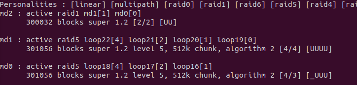

+ Deve desmontar o sistema de ficheiros.
****
    sudo umount /mnt/raid2

+ Deve parar (--stop) os dispositivos antes de os reconstruir (após a falha não se pode adicionar novos discos).
****
    sudo mdadm --stop /dev/md2
    sudo mdadm --stop /dev/md0
    sudo mdadm --stop /dev/md1

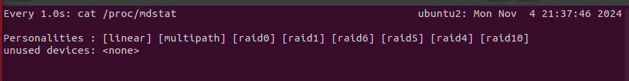

+ Se um dispositivo fizer parte de um RAID tem de parar esse RAID primeiro.
****
    Basicamente como /dev/md2 contem /dev/md0 e /dev/md1 , a ordem com que paramos importa, ou seja, primeiro temos de parar /dev/md2 e so depois podemos parar /dev/md1 e /dev/md0 (estes dois ultimos em qualquer ordem)

+ Para remontar os dispositivos pode ter de forçar
****
    # loopI depende do output de losetup -a | grep arquivo (escolher loopI que pertenciam ao md0)

    sudo mdadm --assemble --force /dev/md0 /dev/loop15 /dev/loop16 /dev/loop17 /dev/loop18

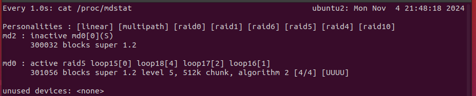

+ E mesmo adicionar discos que não foram colocados automaticamente (apenas o mínimo para carregar o array)
****

    mdadm --manage /dev/md0 --add /dev/loop15 

## RAID 1 + 0 (RAID 10)

Usando os ficheiros disc criados anteriormente vamos agora criar um RAID 1+0

1. Pare todos os RAIDs existentes. Pode fazer:
****
    sudo mdadm --stop --scan

+  Verifique no /proc/mdstat ou com mdadm --detail --scan
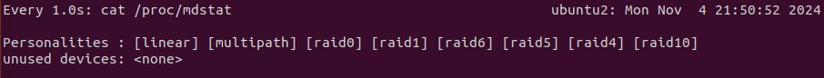

2. Deve "limpar" os loop utilizando o wipefs. ou o mdadm --zero-superblock. Caso não o faça o --create na alínea seguinte vai-se queixar, pois os loop ainda pertencem a um RAID.
****

    losetup -a | grep arquivo (para descobir os /dev/loopI)

    sudo wipefs -a /dev/loopI

    ou 
    sudo mdadm --zero-superblock /dev/loopI

3. Usando o --create construa um RAID 10 com 4 discos de /dev/loop. Note que será RAID 10 e não fazer RAIDs 1 e depois RAID 0 com os "1s".
****

    sudo mdadm --create /dev/md0 --level=10 --raid-devices=4 /dev/loop15 /dev/loop16 /dev/loop17 /dev/loop18

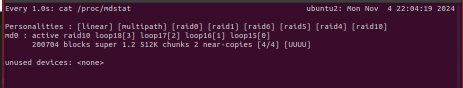

4. Verifique o espaço que tem.
****
    $ sudo mdadm --detail /dev/md0
    ...
     Array Size : 200704 (196.00 MiB 205.52 MB)
    ...

5. Crie um sistema de ficheiros ext4 no md que criou acima e monte-o no sistema de ficheiros corrente.
****
    #Criar o sistema de arquivos:

    sudo mkfs.ext4 /dev/md0

    #Montar o sistema de arquivos:

    sudo mkdir -p /mnt/raid10
    sudo mount /dev/md0 /mnt/raid10

6. Veja o espaço disponível com df -h.
****

    $ df -h /mnt/raid10
    Filesystem      Size  Used Avail Use% Mounted on
    /dev/md0        174M   24K  160M   1% /mnt/raid10

7. Copie alguns ficheiros (alguns discs?) para o novo sistema.
****

    $ sudo cp ./Desktop/Administracao_Sistemas/README.md /mnt/raid10/
    $ sudo cat /mnt/raid10/README.md
    
8. Coloque a faulty 2 discos de modo a ficar apenas degraded.
****
    Para simular uma falha e degradar o RAID, marque dois dispositivos como faulty. Isso deixará o RAID degradado, mas ainda funcional, pois o RAID 10 suporta até metade dos discos falhando (desde que não seja um espelho completo).

    sudo mdadm /dev/md0 --fail /dev/loop15
    sudo mdadm /dev/md0 --fail /dev/loop17

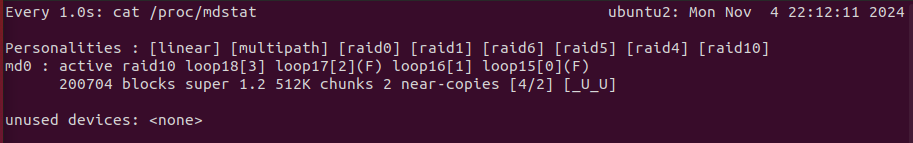

9. Remova esses discos e adicione outros (ou até os mesmos) ao RAID de modo a ficar normal outra vez
****

    #Remover Discos Faulty
    sudo mdadm /dev/md0 --remove /dev/loop15
    sudo mdadm /dev/md0 --remove /dev/loop17

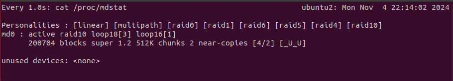

    #Adicionar os mesmos discos novamente

    sudo mdadm --manage /dev/md0 --add /dev/loop15
    sudo mdadm --manage /dev/md0 --add /dev/loop17

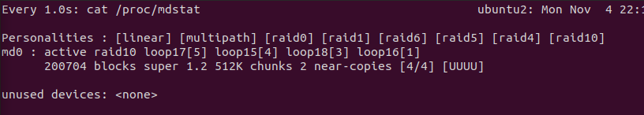

## RAID 10 e expansão

1. Após o md0 anterior estar activo e sem degradação adicione dois /dev/loop que ainda não estejam no md0.
****
    # escolhi loopI que nao esta em md0 e estao no output de losetup -a | grep arquivo

    sudo mdadm --manage /dev/md0 --add /dev/loop21
    sudo mdadm --manage /dev/md0 --add /dev/loop22

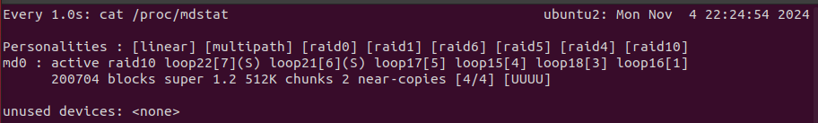

+ Estão a ser usados? O que indica o spare?
****
    R: Nao

    Dispositivos spare ficam prontos para substituir discos ativos em caso de falha, mas ainda não são utilizados para expandir a capacidade até o array ser "crescido".

2. Verifique o espaço disponível no RAID e no sistema de ficheiros montado.
****

    $ sudo mdadm --detail /dev/md0
    ...
    Array Size : 200704 (196.00 MiB 205.52 MB)
    Used Dev Size : 100352 (98.00 MiB 102.76 MB)
    ...

    ou 

    $ df -h /mnt/raid10
    Filesystem      Size  Used Avail Use% Mounted on
    /dev/md0        174M   28K  160M   1% /mnt/raid10

3. Faça crescer o sistema md0 usando:
****
> mdadm --grow /dev/md0 --raid-devices=6
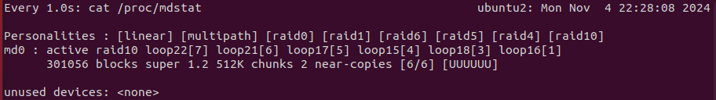

+ O que se fez com o comando anterior?
****
    Este comando reconfigura o RAID 10 para incluir os novos dispositivos (loop4 e loop5) no array principal, expandindo sua capacidade total. O array passará por uma reconstrução para integrar esses discos ao sistema.
+ Qual o espaço do RAID agora?
****
     $ sudo mdadm --detail /dev/md0
     ...  
     Array Size : 301056 (294.00 MiB 308.28 MB)
     Used Dev Size : 100352 (98.00 MiB 102.76 MB)
     ...

>Nota Used Dev Size e o mesmo, so aumenta Array Size

+ Qual o espaço do sistema de ficheiros montado?
****
    $ df -h /mnt/raid10
    Filesystem      Size  Used Avail Use% Mounted on
    /dev/md0        174M   28K  160M   1% /mnt/raid10

4. Usando o comando resize2fs aumenta o tamanho do sistema de ficheiros. Verifique.
****

    $ sudo resize2fs /dev/md0
    resize2fs 1.45.5 (07-Jan-2020)
    Filesystem at /dev/md0 is mounted on /mnt/raid10; online resizing required
    old_desc_blocks = 1, new_desc_blocks = 1
    resize2fs: Input/output error While checking for online resizing support

    $ df -h /mnt/raid10
    Filesystem      Size  Used Avail Use% Mounted on
    /dev/md0        269M   28K  254M   1% /mnt/raid10

>Aumentou de 160M para 254M

